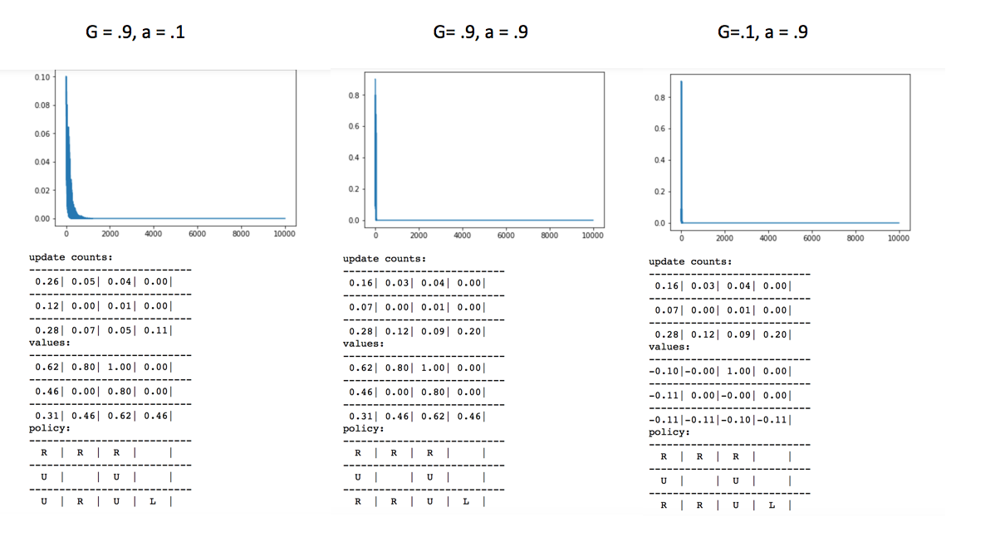

# Qlearning_grid_world

 The Q Learning algorithm is so far the most upowerful algorithm to-date being used to solve complex Monte carlo Processes. Similiar to Monte Carlo Prediction and Temporal Difference, Q learning uses the state-action space to estimate the values and update the Q function (value function). The true difference comes with the ability for Q Learning to look-ahead to future state-action spaces and determine the best action for the given policy for all possible state-actions. One importatnt thing to notice is how much information the Q value will contain in a given enviroment. Since Q learning requires caluculating all possibilities of future states-actions, this algorithm has the potential to exhaust your memory pretty quickly in a large enviroment. Thus, they have developed Deep Q Learning to solve this problem. Basically, they use a Deep Nueral Net to apoximate the Q function and call it a day. This technique was used by Google's DeepMind to win against a human in the game Go. For this experiemnt, I will play with different values of the discount rate and learning rate to see how it changes the Q learning algorithm. 

 Notice how for values of our discount rate (gamma) and laerning rate (alpha) performed optimal for only certain values. This is the key to question for Q learning and when to use large and small values for alpha and gamma in your model. Since it is not entirely clear yet what the optimal values for all enviroments, i will just say it is new interest of study to understand the optimal hyper-parameter values to given models. Thus, it would be most interestion to study how those values change depending on model you are trying to optimize.

  

## Conclusion

 For this problem, I learned how well Q learning converged to an optimal policy. I also discovered how computationaly exhaustive this algorithm can get given its nature of look-ahead. Additionally, it is worth investigating how to use a Deep Nueral Network to approxiamte the Q function for a large envriment. Lastly, and most important, Q learning is dependent upon reasonable values of Gamma and Alpha. Conswequently, studying the type of problem you are trying to solve along with what conventiently has worked in the past to solve it, is the most important factor in optimizing the policy for a given enviroment. 

